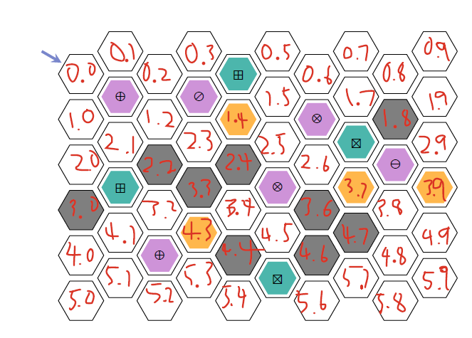

## CSC3206 Assignment 2 – Treasure Hunt AI
A Python program that solves a treasure hunt problem in a virtual world filled with traps, rewards, and obstacles using uniform-cost search algorithm.

## Map Legend
| Legend 1 | Legend 2 |
|----------|----------|
|  |  |
| *Map overview* | *Trap and reward description* |

## Final Path and Labeled Map
| Final Path Taken | Labeled Map |
|------------------|-------------|
|  |  |
| *The final path for assignment's map* | *Map with each cell labeled for reference* |

## Requirements
- Python 3.10 or above

## How to Run
Clone project and run `python main.py` in terminal. 